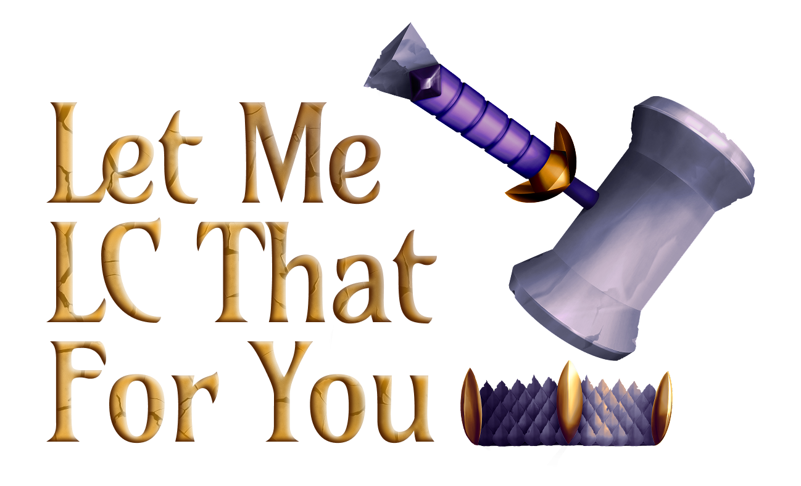
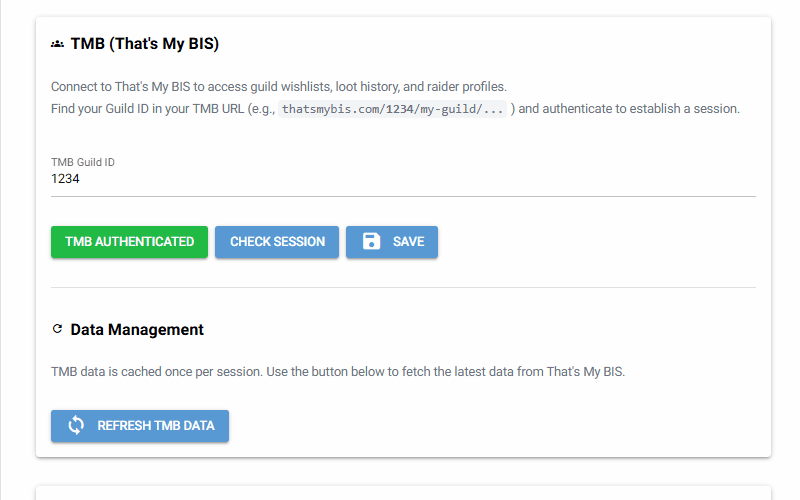
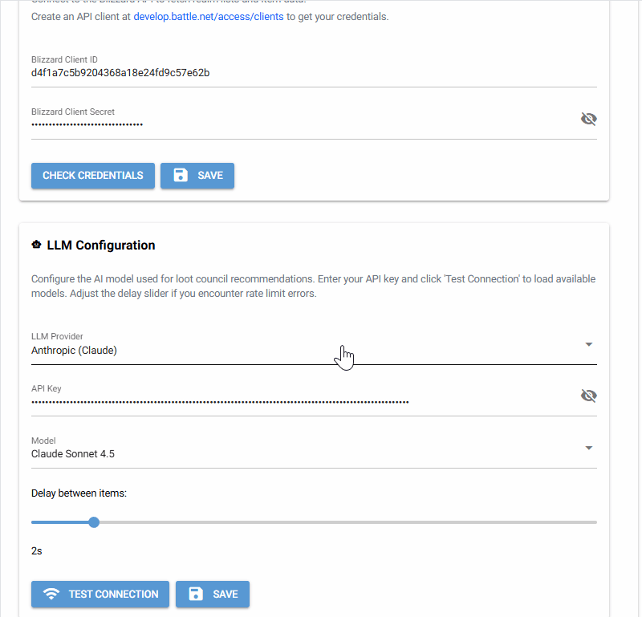
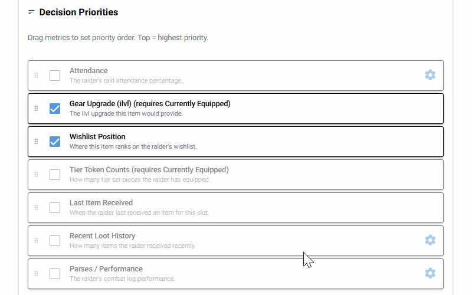
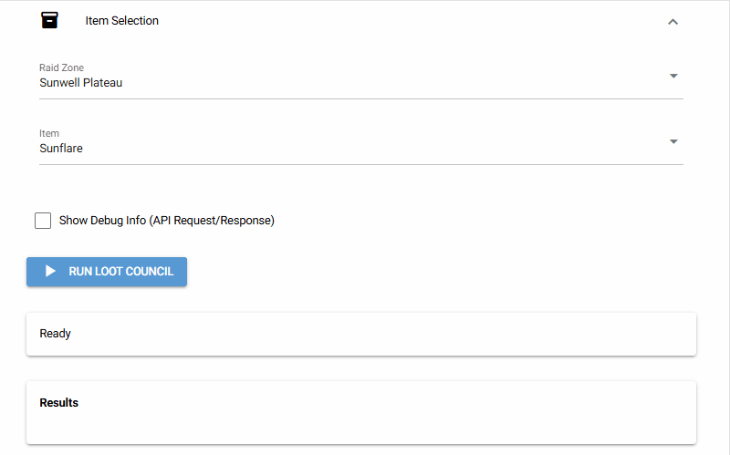

*Logo by [Erik Padamans](https://dribbble.com/ErikPadamans)*

**An open source, AI-powered loot council assistant for World of Warcraft Classic (TBC Anniversary & Era)**

[](https://opensource.org/licenses/MIT)
[](#installation)
[](#installation)
[](https://discord.gg/RGmymTJCnR)

---

> **🚧 Beta Notice:** This app is currently in beta. If you encounter any bugs or issues, please report them through [GitHub Issues](https://github.com/rashad-malik/letmelcthatforyou/issues) or on the [Discord](https://discord.gg/RGmymTJCnR). Your feedback helps improve the app!

## What is this?

**Let Me LC That For You** helps guild loot councils make fair, consistent loot distribution decisions using AI. It pulls data from ThatsMyBIS and WarcraftLogs, analyses each candidate based on your guild's loot policy, and provides intelligent recommendations with clear reasoning.

---

## Features

- **AI-Powered Recommendations** - Uses LLMs to analyse candidates and explain loot decisions
- **9 LLM Providers** - Anthropic Claude, OpenAI GPT, Google Gemini, Mistral AI, Groq Fast Inference, xAI Grok, Cohere, Together AI, DeepSeek
- **ThatsMyBIS Integration** - Wishlist priorities, loot history, attendance records, guild item notes, raider notes
- **WarcraftLogs Integration** - Parse performance, character gear
- **Blizzard API Integration** - Real-time character equipment data
- **Customisable Guild Policies** - Write your own loot rules in Markdown or use simple metric-based decision priorities
- **Comprehensive Player Metrics**:
  - Attendance percentage (configurable lookback)
  - Recent loot received (configurable lookback)
  - Wishlist priority position
  - Main vs Alt status
  - Parse performance (best/median by zone)
  - Item level upgrade size
  - Tier token completion tracking
  - Custom raider notes
  - ... and more!
- **Batch Processing** - Process entire raid zones item-by-item with progress tracking
- **CSV Export** - Save all decisions for review and record-keeping

<table>
  <tr>
    <td align="center"><br><b>Setup the main integrations</b></td>
    <td align="center"><br><b>Choose your LLM and model</b></td>
  </tr>
  <tr>
    <td align="center"><br><b>Select player metrics and loot policies</b></td>
    <td align="center"><br><b>Get LC suggestions with detailed descriptions</b></td>
  </tr>
</table>

> **Note:** All API keys and credentials shown in the demos above are fake. Never publicly reveal your real API keys or secrets.

---

## Installation

### Option A: Download Executable (Recommended)

Download the latest release for your platform:

| Platform | Download |
|----------|----------|
| **Windows** | [LetMeLCThatForYou.exe](https://github.com/rashad-malik/letmelcthatforyou/releases/latest) |
| **Linux** | [LetMeLCThatForYou.AppImage](https://github.com/rashad-malik/letmelcthatforyou/releases/latest) |

Simply download and run - no installation required.

### Option B: Run from Source

Requires [UV](https://github.com/astral-sh/uv) package manager and Python 3.11+.

**1. Install UV**

Windows (PowerShell):
```powershell
powershell -c "irm https://astral.sh/uv/install.ps1 | iex"
```

macOS/Linux:
```bash
curl -LsSf https://astral.sh/uv/install.sh | sh
```

**2. Clone and Run**

```bash
git clone https://github.com/rashad-malik/letmelcthatforyou.git
cd letmelcthatforyou
uv sync
uv run playwright install
uv run python -m wowlc
```

This opens a NiceGUI interface for configuration and running loot council.

---

## How to Update

### Executable Users

1. Download the latest release from the [Releases page](https://github.com/rashad-malik/letmelcthatforyou/releases/latest)
2. Replace your existing `.exe` or `.AppImage` file with the new one
3. Launch the new version — your settings and data are stored separately and will be preserved

### Source Users

```bash
cd letmelcthatforyou
git pull
uv sync
uv run python -m wowlc
```

---

## Quick Start

### Prerequisites

You'll need:
1. **ThatsMyBIS Guild ID** - Found in your TMB guild URL (e.g., `1234` from `thatsmybis.com/1234/my-guild/...`)
2. **WarcraftLogs API credentials** - [Create an API client here](https://www.warcraftlogs.com/api/clients) with the following redirect URLs:
   - `https://www.warcraftlogs.com/api/v2-explorer`
   - `http://localhost:8765/callback`
3. **Blizzard API credentials** - [Create an API client here](https://develop.battle.net/access/clients) with the following redirect URLs:
   - `https://community.developer.battle.net`
   - `http://localhost`
4. **LLM API key** - From any supported provider (Anthropic, OpenAI, etc.)

### First-Time Setup

1. **Launch the application**
2. **Select your game version** - Use the toggle at the top to choose between Era and TBC Anniversary
3. **Click the "WoW Server" button in the header** - Select your server region and realm
4. **Go to "Core Connections" tab**:
   - Enter your TMB Guild ID, and authenticate your TMB session
   - Enter your WarcraftLogs Client ID and Secret
   - Enter your Blizzard API Client ID and Secret
   - Select your LLM provider and enter your API key
5. **Go to "Settings" tab** - Configure which player metrics to include
6. **Go to "Run LC" tab**:
   - Choose Single Item or Raid Zone mode
   - Select an item or raid zones
   - Click "Run Loot Council"
7. **Review results** - Each item shows the AI's recommendation with reasoning

---

## Configuration

### Game Version
- TBC Anniversary or Era (WIP)

> **Note:** Era functionality is still a work in progress. It should be functional, but some items (such as tier tokens) may be missing.

### Core Connections Tab
- **ThatsMyBIS** - Guild ID and Discord authentication
- **WarcraftLogs** - API credentials for pulling log data
- **Blizzard API** - For real-time character equipment (armoury)
- **LLM Provider** - Select AI provider and model, enter API key

### Settings Tab
- **Candidate Rules** - Configure who can receive loot: allow alts, give priority to mains, enable tank priority, and include raider notes (public or officer)
- **Policy Mode** - Choose between Simple (metric-based priority rules) or Custom (freeform written policy)
- **Decision Priorities** (Simple mode) - Drag-and-drop metrics to set priority order; top = highest priority. Each metric can be toggled on/off and some have sub-settings (e.g. attendance lookback days, parse zone, loot lookback days)
- **Generated Rules Preview** (Simple mode) - Live preview of the numbered rules that will be sent to the LLM based on your metric selections
- **Tracked Metrics & Custom Policy** (Custom mode) - Toggle which metrics appear in candidate data, and write your own guild loot policy in a freeform text editor
- **Currently Equipped** - Optionally fetch each raider's equipped gear via the Blizzard API or WarcraftLogs API, enabling ilvl upgrade comparisons and tier token tracking

### Run LC Tab
- **Mode Selection** - Single item lookup or full raid zone processing
- **Zone Selection** - Pick the raid to process
- **Progress Tracking** - Watch as items are analysed
- **Results Display** - View recommendations with full reasoning

---

## Player Metrics

The AI considers these metrics when making recommendations:

| Metric | Description |
|--------|-------------|
| **Attendance** | Raid attendance percentage over configurable period |
| **Recent Loot** | Items received over configurable period |
| **Wishlist Position** | Priority ranking on ThatsMyBIS wishlist |
| **Alt Status** | Whether the character is a main or alt |
| **Parses** | WarcraftLogs performance averages (best and median) |
| **iLvl Upgrade** | How much the item improves their current gear |
| **Tier Tokens** | Progress toward tier set completion |
| **Raider Notes** | Custom notes you've added for each player |
| **Tank Priority** | Optional priority for tanks |

Toggle metrics on/off in Settings to customise what the AI considers.

---

## Supported LLM Providers

| Provider | Example Models |
|----------|----------------|
| **Anthropic** | Claude Sonnet 4.5, Claude Opus 4.5 |
| **OpenAI** | GPT-5, GPT-4 |
| **Google** | Gemini 1.5 Pro, Gemini 1.5 Flash |
| **Mistral** | Mistral Large, Mistral Medium |
| **Groq** | Llama 3, Mixtral |
| **xAI** | Grok |
| **Cohere** | Command R+ |
| **Together AI** | Various open source models |
| **DeepSeek** | DeepSeek Chat |

---

## Data Storage

### User Files (Documents folder)
```
Documents/Let Me LC That For You/
├── guild_loot_policy.md    # Your customisable loot policy if using Custom mode
└── Exports/                # CSV exports of loot decisions
└── Logs/                   # Log file for debugging and error tracking
```

### Application Data (AppData folder)
```
AppData/Local/letmelcthatforyou/
├── config.json             # Settings and API credentials
├── auth/                   # Authentication tokens
└── cache/                  # Cached raider and item data
```

---

## Future Enhancements

Planned features for upcoming releases:

- **BoP Gear Recipes** - Support for bind-on-pickup crafted gear and player profession considerations
- **Extended Parse Options** - Additional parse filtering options (e.g., parses by average item level)
- **Path Configuration** - User-configurable paths for application files and exports
- **Custom Realm Lists** - User-defined realm lists for servers not included in the default selection

---

## Troubleshooting

### UV not found
Restart your terminal after installing UV, or ensure it's in your PATH.

### Playwright browser errors
Run `uv run playwright install` to download required browser binaries.

### TMB Authentication Issues
- Verify your TMB Guild ID is correct
- Re-authenticate by clicking "Authenticate TMB"
- Ensure you have access to the guild on ThatsMyBIS

### WCL Authentication Issues
- Double-check your Client ID and Secret
- For private/archived logs, use the WCL OAuth flow in Developer Tools

### LLM API Errors
- Verify your API key is correct
- Check your API quota and billing status
- Increase delay between requests if hitting rate limits

## FAQ

### What raid sizes does this app support?

The app focuses on **25-man raids** for TBC Anniversary and **40-man raids** for Classic Era. Smaller raid sizes (e.g. Karazhan) are not the primary focus.

### Does the app support languages other than English?

No. The application is **English only** — the interface, AI prompts, and all API integrations are in English. There is no localisation support at this time.

### What should I set up on That's My BIS for this app to work well?

The more complete your TMB data, the better the recommendations. Here's what matters most:

| Field | Importance | Why |
|-------|------------|-----|
| **Wishlists** | Essential | Characters without wishlists will not appear as candidates for any items |
| **Attendance records** | High | Used to calculate raid attendance percentage |
| **Received loot history** | High | Tracks recent loot and tier token progress |
| **Character archetype** (Tank/Healer/DPS) | High | Determines the parse metric type and role context for recommendations |
| **Alt status** | High | Distinguishes mains from alts for filtering and priority |
| **Mainspec vs offspec** flags on wishlist items | High | Ensures mainspec needs are prioritised correctly |
| **Item tier class** (e.g. S, A, B) | Recommended | Raid zone LC processes higher-tier items first, leading to fairer overall distribution — TMB's default tiers work fine |
| **Item notes / prio notes** | Recommended | Guild-level item priority notes are included in the AI prompt |
| **Raider notes** (public/officer) | Optional | Shown to the AI if enabled in settings — useful for special considerations |

### Will I hit WarcraftLogs API rate limits?

Standard (free) WarcraftLogs accounts have reasonable hourly API limits, which should be sufficient for most guilds. However, if you have an exceptionally large raid team or run the app frequently, you may hit those limits. If this happens, consider subscribing to one of WarcraftLogs' paid tiers, which offer increased API allowances.

### When is the best time to use this app?

**Before your raid**, not during it. The app is not designed for mid-raid use, particularly when processing an entire raid zone's worth of loot council decisions. The recommended workflow is:

1. Run the app before raid night to generate recommendations
2. Review the AI's suggestions and update item/player priority choices on That's My BIS accordingly
3. Use those updated priorities as a reference during the raid itself

> **Remember:** AI recommendations are a starting point, not a final verdict. Always apply human judgement when making loot decisions.

---

## Acknowledgements & Special Thanks

### ThatsMyBIS

A heartfelt thank you to **[Lemmings19](https://github.com/Lemmings19)** for creating **[ThatsMyBIS](https://thatsmybis.com/)**. His amazing tool helped me and my guild throughout TBC Classic 2021 and WotLK Classic. Without his platform, this app would not exist.

### Tools & Platforms

This project also wouldn't be possible without these tools and platforms:

- **[WarcraftLogs](https://www.warcraftlogs.com/)** - The gold standard for WoW raid logging and performance analysis
- **[Blizzard Entertainment](https://develop.battle.net/)** - For WoW Classic APIs
- **[Nexus-Devs wow-classic-items](https://github.com/nexus-devs/wow-classic-items)** - Comprehensive WoW Classic item database
- **[LiteLLM](https://github.com/BerriAI/litellm)** - Connects to AI providers and provides useful tools such as token counts and cost estimates
- **[OpenRouter](https://openrouter.ai/)** - Model metadata API for human-readable model names
- **[NiceGUI](https://nicegui.io/)** - Python-based browser GUI framework
- **[Astral UV](https://github.com/astral-sh/uv)** - Python package management

### Community

Finally, a huge thank you to my guildies from **[Off Topic](https://classic.warcraftlogs.com/guild/id/602305)**, and to my friends **[adam-tj](https://github.com/adam-tj)** and **Koncker** for helping me test and brainstorm solutions for this app.

---

## License

This project is licensed under the MIT License - see the [LICENSE](LICENSE) file for details.

---

## Disclaimer

This project is not affiliated with or endorsed by Blizzard Entertainment. World of Warcraft, WoW, and related assets are trademarks of Blizzard Entertainment, Inc.

Use this tool responsibly and in accordance with your guild's policies.
